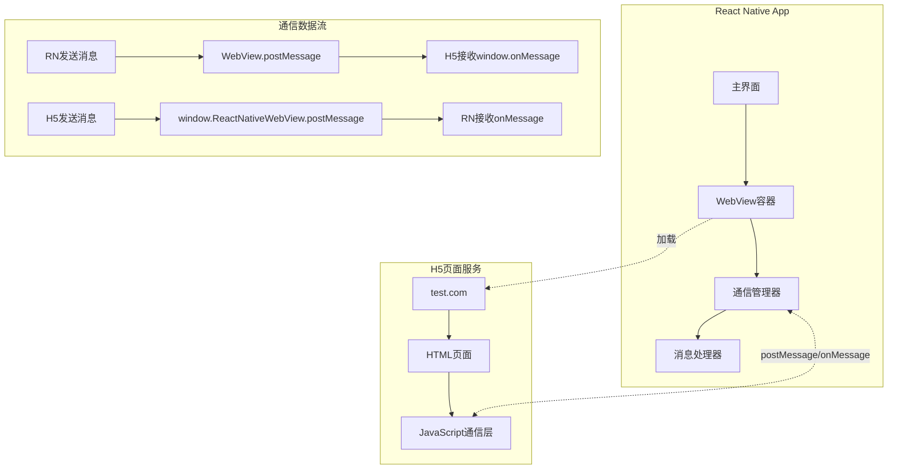
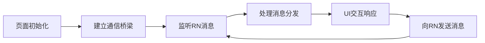
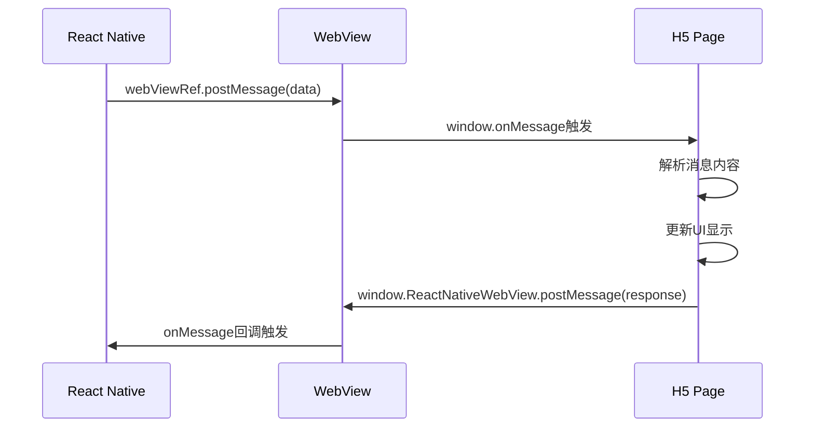
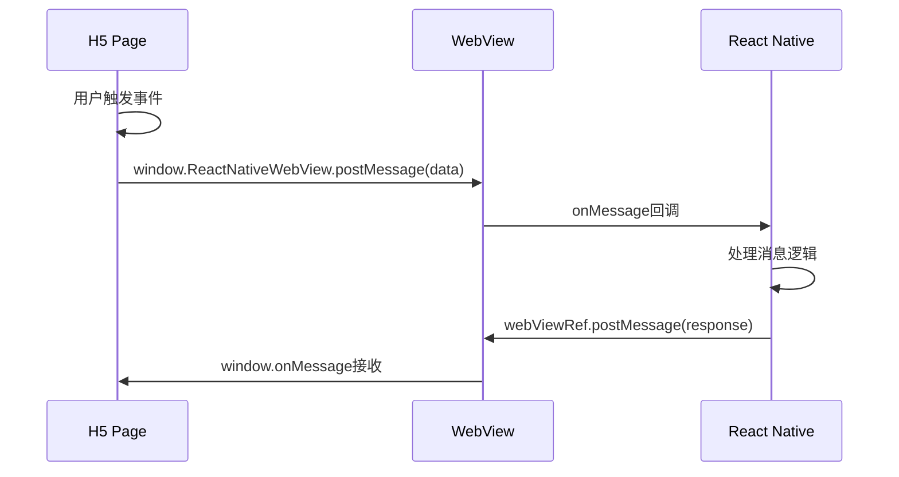
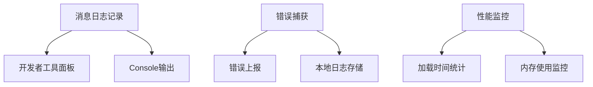
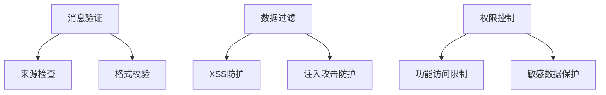
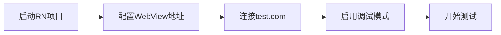

# React Native H5通信测试设计方案

## 概述

在React Native (Expo)项目中集成WebView加载本地H5页面，实现RN与H5之间的双向通信功能。通过postMessage和onMessage机制建立通信桥梁，支持数据传递、事件触发等交互场景。

## 技术栈

- **React Native**: 0.81.4 (Expo 54.0.0)
- **WebView**: react-native-webview 13.15.0
- **H5页面**: test.com (外部H5页面)
- **H5技术**: HTML5, JavaScript ES6+

## 架构设计

### 整体架构



### 组件架构

```mermaid
classDiagram
    class WebViewTestScreen {
        +state: webViewRef, messages
        +sendMessageToH5()
        +handleMessageFromH5()
        +render()
    }
    
    class CommunicationManager {
        +sendToH5(data)
        +receiveFromH5(callback)
        +formatMessage(type, payload)
    }
    
    class H5Bridge {
        +sendToRN(data)
        +receiveFromRN(callback)
        +initBridge()
    }
    
    WebViewTestScreen --> CommunicationManager
    CommunicationManager -.-> H5Bridge
```

## 功能模块设计

### 1. WebView容器组件

#### 组件接口定义

```typescript
interface WebViewTestProps {
  url?: string;
  onReady?: () => void;
  onError?: (error: any) => void;
}

interface WebViewTestState {
  isLoading: boolean;
  messages: MessageProtocol[];
  connectionStatus: 'connecting' | 'connected' | 'disconnected';
}
```

#### 核心属性配置

| 属性 | 类型 | 说明 |
|------|------|------|
| source | object | H5页面地址配置 |
| onMessage | function | 接收H5消息回调 |
| ref | ref | WebView引用，用于发送消息 |
| javaScriptEnabled | boolean | 启用JavaScript执行 |
| domStorageEnabled | boolean | 启用DOM存储 |

#### 组件结构设计

```typescript
const WebViewTestScreen = () => {
  // 状态管理
  const webViewRef = useRef<WebView>(null);
  const [messages, setMessages] = useState<MessageProtocol[]>([]);
  const [isConnected, setIsConnected] = useState(false);
  
  // 核心方法
  const sendMessageToH5 = (message: MessageProtocol) => { /* 实现逻辑 */ };
  const handleMessageFromH5 = (event: WebViewMessageEvent) => { /* 实现逻辑 */ };
  const onWebViewLoad = () => { /* 实现逻辑 */ };
  const onWebViewError = (error: any) => { /* 实现逻辑 */ };
  
  return (
    // JSX结构
  );
};
```

### 2. 通信协议定义

#### 消息格式规范

```typescript
interface MessageProtocol {
  type: 'greeting' | 'data' | 'action' | 'response';
  timestamp: number;
  payload: any;
  messageId?: string;
  source: 'rn' | 'h5';
}

// 具体消息类型定义
interface GreetingMessage extends MessageProtocol {
  type: 'greeting';
  payload: {
    status: 'ready' | 'error';
    version?: string;
  };
}

interface DataMessage extends MessageProtocol {
  type: 'data';
  payload: {
    userInfo?: UserInfo;
    config?: AppConfig;
    [key: string]: any;
  };
}

interface ActionMessage extends MessageProtocol {
  type: 'action';
  payload: {
    action: 'navigate' | 'share' | 'close' | 'refresh';
    params?: any;
  };
}
```

#### 通信管理器设计

```typescript
class CommunicationManager {
  private webViewRef: RefObject<WebView>;
  private messageQueue: MessageProtocol[] = [];
  private listeners: Map<string, Function> = new Map();
  
  constructor(webViewRef: RefObject<WebView>) {
    this.webViewRef = webViewRef;
  }
  
  // 发送消息到H5
  sendToH5(message: MessageProtocol): void {
    const messageString = JSON.stringify(message);
    this.webViewRef.current?.postMessage(messageString);
  }
  
  // 处理来自H5的消息
  handleMessageFromH5(event: WebViewMessageEvent): void {
    try {
      const message: MessageProtocol = JSON.parse(event.nativeEvent.data);
      this.processMessage(message);
    } catch (error) {
      console.error('解析H5消息失败:', error);
    }
  }
  
  // 注册消息监听器
  on(type: string, callback: Function): void {
    this.listeners.set(type, callback);
  }
  
  // 移除消息监听器
  off(type: string): void {
    this.listeners.delete(type);
  }
  
  private processMessage(message: MessageProtocol): void {
    const listener = this.listeners.get(message.type);
    if (listener) {
      listener(message);
    }
  }
}
```

#### 通信类型

| 消息类型 | 方向 | 用途 | 示例载荷 |
|----------|------|------|----------|
| greeting | H5→RN | 初始化确认 | `{status: 'ready'}` |
| userInfo | RN→H5 | 传递用户数据 | `{name: 'test', id: 123}` |
| action | H5→RN | 触发RN操作 | `{action: 'navigate', page: 'profile'}` |
| response | RN→H5 | 响应H5请求 | `{success: true, data: {...}}` |

### 3. H5页面结构

#### 核心功能模块



#### H5通信桥梁设计

```javascript
// H5端通信桥梁类
class RNBridge {
  constructor() {
    this.isReady = false;
    this.messageQueue = [];
    this.listeners = new Map();
    this.init();
  }
  
  // 初始化通信桥梁
  init() {
    // 监听来自RN的消息
    window.addEventListener('message', (event) => {
      this.handleMessageFromRN(event.data);
    });
    
    // 发送准备就绪消息
    this.sendToRN({
      type: 'greeting',
      timestamp: Date.now(),
      payload: { status: 'ready' },
      source: 'h5'
    });
  }
  
  // 发送消息到RN
  sendToRN(message) {
    if (window.ReactNativeWebView) {
      window.ReactNativeWebView.postMessage(JSON.stringify(message));
    } else {
      console.warn('ReactNativeWebView不可用');
    }
  }
  
  // 处理来自RN的消息
  handleMessageFromRN(data) {
    try {
      const message = JSON.parse(data);
      const listener = this.listeners.get(message.type);
      if (listener) {
        listener(message);
      }
    } catch (error) {
      console.error('解析RN消息失败:', error);
    }
  }
  
  // 注册消息监听器
  on(type, callback) {
    this.listeners.set(type, callback);
  }
  
  // 移除监听器
  off(type) {
    this.listeners.delete(type);
  }
}

// 全局桥梁实例
const bridge = new RNBridge();
```

#### H5页面结构设计

```html
<!DOCTYPE html>
<html>
<head>
  <meta charset="UTF-8">
  <meta name="viewport" content="width=device-width, initial-scale=1.0">
  <title>RN通信测试</title>
  <style>
    /* 基础样式定义 */
    .container { /* 布局样式 */ }
    .message-list { /* 消息列表样式 */ }
    .input-area { /* 输入区域样式 */ }
    .status-bar { /* 状态栏样式 */ }
  </style>
</head>
<body>
  <div class="container">
    <div class="status-bar">
      <span id="status">连接状态: 未连接</span>
    </div>
    
    <div class="message-list" id="messageList">
      <!-- 消息显示区域 -->
    </div>
    
    <div class="input-area">
      <input type="text" id="messageInput" placeholder="输入测试消息">
      <button onclick="sendTestMessage()">发送到RN</button>
      <button onclick="sendUserInfo()">发送用户信息</button>
      <button onclick="triggerAction()">触发RN操作</button>
    </div>
  </div>
  
  <script>
    // JavaScript业务逻辑
    function sendTestMessage() { /* 实现逻辑 */ }
    function sendUserInfo() { /* 实现逻辑 */ }
    function triggerAction() { /* 实现逻辑 */ }
    function updateMessageList(message) { /* 实现逻辑 */ }
    function updateStatus(status) { /* 实现逻辑 */ }
  </script>
</body>
</html>
```

#### 交互界面设计

| 组件 | 功能 | 触发事件 | 实现方法 |
|------|------|----------|----------|
| 发送消息按钮 | 向RN发送测试消息 | click | sendTestMessage() |
| 消息显示区域 | 展示接收到的RN消息 | 自动更新 | updateMessageList() |
| 数据输入框 | 用户输入测试数据 | input | 实时验证 |
| 状态指示器 | 显示通信连接状态 | 自动更新 | updateStatus() |

## H5页面配置

### 页面地址配置

| 环境 | 地址 | 说明 |
|------|------|------|
| 测试环境 | http://test.com | H5测试页面地址 |
| 开发调试 | http://test.com/debug | 带调试功能的页面 |

### H5页面要求

- 支持JavaScript执行
- 包含通信桥梁代码
- 响应式设计适配移动端
- 支持postMessage通信协议

## 数据流设计

### RN到H5通信流程



### H5到RN通信流程



## 错误处理机制

### 异常场景处理

| 错误类型 | 检测方式 | 处理策略 |
|----------|----------|----------|
| 网络连接失败 | onError回调 | 显示重试按钮 |
| 消息格式错误 | JSON解析异常 | 忽略并记录日志 |
| H5加载超时 | onLoadEnd + 定时器 | 显示错误页面 |
| 通信中断 | 心跳检测 | 自动重连机制 |

### 调试工具设计



## 测试策略

### 功能测试用例

| 测试场景 | 预期结果 | 验证方法 |
|----------|----------|----------|
| 基础通信 | RN和H5能够互相发送接收消息 | 消息计数器 |
| 数据传递 | 复杂对象能够正确序列化传输 | JSON对比 |
| 高频通信 | 连续发送消息不丢失 | 序列号验证 |
| 错误恢复 | 异常后能够重建通信 | 模拟网络中断 |

### 性能测试指标

| 指标 | 目标值 | 测量方法 |
|------|--------|----------|
| 页面加载时间 | < 2秒 | onLoadEnd计时 |
| 消息传输延迟 | < 100ms | 时间戳对比 |
| 内存占用 | < 50MB | 开发者工具监控 |
| CPU使用率 | < 20% | 性能分析器 |

## 安全考虑

### 通信安全措施



### 安全检查清单

- [ ] 验证消息来源域名
- [ ] 过滤HTML标签和脚本
- [ ] 限制可调用的RN方法
- [ ] 加密敏感数据传输
- [ ] 设置通信频率限制

## 部署配置

### 开发环境配置



### 环境配置

| 配置项 | 开发环境 | 生产环境 |
|--------|----------|----------|
| H5地址 | http://test.com | http://test.com |
| 调试模式 | 开启 | 关闭 |
| 错误上报 | 控制台 | 远程日志服务 |
| 缓存策略 | 禁用 | 启用缓存 |